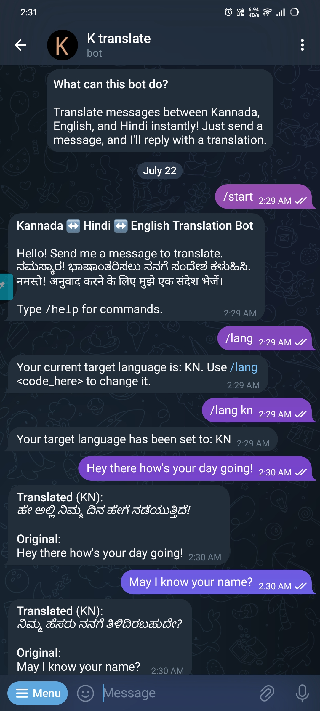
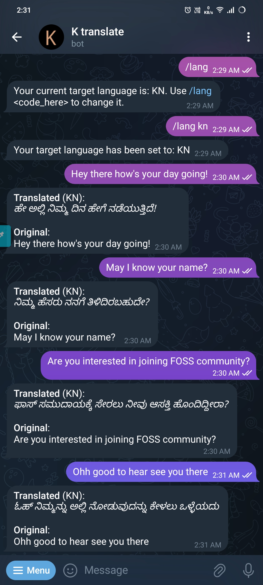

##  Kannada Translation Bot – Project Structure

```
ktranslate/
├── bot/                            # Chatbot interface layer
│   ├── __init__.py
│   ├── telegram_bot.py             # Telegram bot handler (receives messages, replies)
│   └── whatsapp_bot.py             # (Optional) WhatsApp integration via Twilio/Meta API
│
├── core/                           # Core NLP and translation routing logic
│   ├── __init__.py
│   ├── translation_engine.py       # Unified interface to translation backends
│   ├── utils.py                    # Pre/post-processing: cleaning, normalization, etc.
│   └── language_router.py          # Detect source/target language, tone handling
│
├── services/                       # Translation engines (pluggable modules)
│   ├── google_translate.py         # Google Translate API wrapper
│   ├── indictrans2_service.py      # IndicTrans2 (HuggingFace or local inference)
│   └── bhashini_api.py             # Govt. of India Bhashini API (for Kannada/Hindi)
│
├── api/                            # (Optional) Web client or admin dashboard via FastAPI
│   ├── main.py                     # Entry for FastAPI server
│   └── routes.py                   # REST endpoints (e.g., `/translate`)
│
├── data/                           # Input/output samples, evaluation data
│   └── test_phrases.csv            # List of test sentences for benchmarking
│
├── database/                       # DB schema + persistence layer (if used)
│   ├── models.py                   # SQLAlchemy models for users, logs, etc.
│   └── crud.py                     # Create/Read/Update/Delete DB ops
│
├── experiments/                    # Translation quality, prompt tuning, evals
│   └── test_google_vs_indictrans.ipynb  # Notebook comparing engines
│
├── config/                         # Global constants and API keys (use dotenv or pydantic)
│   └── settings.py
│
├── tests/                          # Unit + integration tests
│   └── test_translation.py         # Sample tests for translation and routing logic
│
├── requirements.txt                # Python dependencies
├── README.md                       # Project overview and usage instructions
└── run_bot.py                      # Main entry point to launch bot (Telegram by default)
```

---

## Image gallery 

<p float="left">
  
   
  
</p>

---
## Setup Instructions

### 1. Install Dependencies
```bash
python -m venv venv
source venv/bin/activate
pip install -r requirements.txt
```

### 2. Environment Variables
Create a `.env` file in the root directory or configure your environment variables in `config/settings.py`.

```ini
# .env file
GOOGLE_API_KEY="your_key_here"
INDIC_MODEL_PATH="/path/to/your/model"
BHASHINI_API_KEY="your_key_here"
TELEGRAM_BOT_TOKEN="your_telegram_bot_token"
```

### 3. Run the Application

**To run the Telegram Bot:**
```bash
python run_bot.py
```

**(Optional) To run the FastAPI Server:**
```bash
uvicorn api.main:app --reload
```

---

